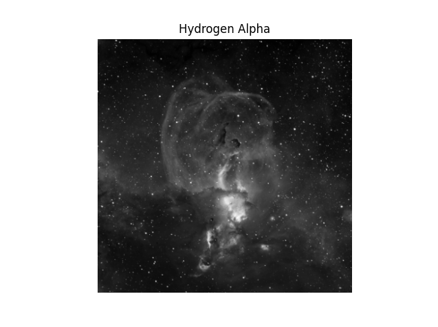
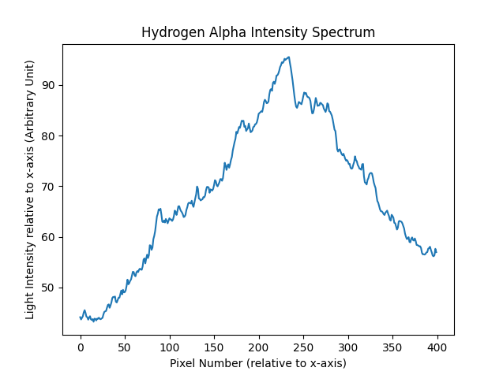
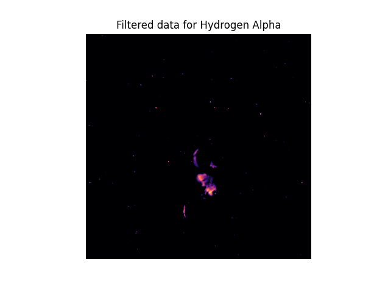
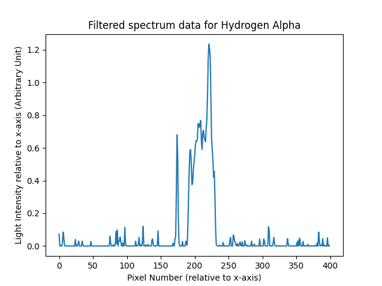

# Nebula Intensity

Analysing areas of high and low intensity of Statue of Liberty Nebulae.

## spectra.py file (by rofhima13)

This file extracts the original image matrices, and filtered image matrices from the DataAnalysis module @Amani5576 constructed from the FIT files, and constructs a horizontal spectrum relative to the x-axis of the image, or from a viewer's point of view, and displays all of the resultant plots using all of the data.

For the purposes of demonstration, only information pertaining to the Hydrogen Alpha spectra will be shown below.

This is what the original Hydrogen Alpha image looks like:



The full spectrum for the Hydrogen Alpha Nebula looks something like this:



When an image is constructed using the filtered data for the Hydrogen Alpha Nebula, it looks something like this (a different color filter is used):



When the below spectrum for the filtered data is compared with the filtered image, it becomes easier to discern where the brightest spots in the image are located.



Taking note of all the above information, looking at the filtered spectrum it's evident that the brightest spots of the Hydrogen Alpha Nebula are located by the horizontal center of the image, and the filtered image reflects that information.

The file can be run by running ```python ./spectra.py``` on any terminal emulator on a computer with Python 3 installed.

Make sure to run ```pip install -r requirements.txt``` before you run!