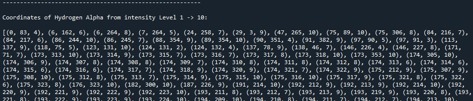
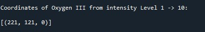
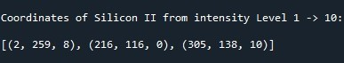

# Nebula Intensity

Analysing areas of high and low intensity of Statue of Liberty Nebulae based on user specifications


## FitExtraction file (by Amani5576)
This file opens and extracts the HDU data from the fit files and puts them into an array; HDUs.
Each fit File consists of a Primary and an Image HDU. These are two sub-lists within each element of HDUs

e.g. HDUs[0] -> [PrimaryHDU, ImageHDU] from Hydrogen Alpha Fit file 
     HDUs[1] -> from Oxygen 3
     HDUs[2] -> from Silicon 2
     
Hence accessing the Image HDU of in row element x : HDUs[x][1]

Running the file allows you to get necessary information from the header of the Primary.

## DataAnalysis.py file (by Amani5576)
This file:
-> Closes the Fit files that were opened in the FitsExtraction.py

-> Takes the Image HDU data of fit files and puts them in numpy arrays

-> Computes Statistical data with regards to pixel numbered values
    - Median pixel value
    - Mode(s) of pixel value(s)
    - Standard Deviation of pixel values.
    
->Allows User input in assesment of relative intenisty based ona specific ImageHDU

-Lets user decide on scaling Factor:

    E.g. You've chosen Scaling factor to be 6 (6 levels of varying intensity):
         If max = 80 and min = 20 then range is (80 - 20) = 60
         By dividing the range by the Scale we get -> 60/6 = 10.
         Hence, from Level 1 (highest intensity) to Level 2
         (Second highest intensity) is a difference of 10.
     
-Lets user decide on the number of level intensities desirable (from highest intesity as the first level)

    e.g. Level 1 -> highest intensity level (Thus, type in the integer "1")
         Level 2 -> 2nd highest intensity up until highest intenisty (Thus, type in the integer "2")
         Level 3 -> 3rd highest intensity up until highest intenisty (Thus, type in the integer "3")
         Level 4 -> 4th highest........            
         
         NOTE: that there automatically exists an initial level 0. This intenisty level is only for 
         one value in particular which has the highest intensity value within the entire matrix.
         
    This essestially decreases processing time.

-Allows user to choose three data ouputs: (which are limited by users chosen Scaling factor)
    -Get pixels that belong to all levels of intensity up until the lowest intensity
    -Get pixels that belong to a particular level of intenisty 
    -let pixels that belong to particular levels of intenisty 
    
The pixels will be given in terms of a tuple:
    ( <x-coord> , <y-coord> , <Intensity level> )

See image below with an example of chosen user input:
Scaling Factor = 40
Level Limit = 10
Last user input = "Yes" (in order to see all levels)


Tuples are used further on in plotting of filtered data:

    For the Hydrogen Alpha Filtered data:
    
    
    For the Oxygen 3 Filtered data:
    
    
    For the Oxygen 3 Filtered data:
    


## showSection.py file (by Amani5576)
This file shows the initial image matrix of Hydrogen Alpha, Oxygen 3 and Silicon 2 data.

This is due to the fact that each numbered value in the matrices is a quanitity of the number of photons captured by the Telescope. Each element is a pixel containing a specified number of photons.

NOTE: Run seperately AFTER running through Data Analysis

Very useful for Comparison between plots from spectra.py

## spectra.py file (by rofhima13)

This file extracts the original image matrices, and filtered image matrices from the DataAnalysis module @Amani5576 constructed from the FIT files, and constructs a horizontal spectrum relative to the x-axis of the image, or from a viewer's point of view, and displays all of the resultant plots using all of the data.

For the purposes of demonstration, only information pertaining to the Hydrogen Alpha spectra will be shown below.

This is what the original Hydrogen Alpha image looks like:


The full spectrum for the Hydrogen Alpha Nebula looks something like this:


When an image is constructed using the filtered data for the Hydrogen Alpha Nebula, it looks something like this (a different color filter is used):


When the below spectrum for the filtered data is compared with the filtered image, it becomes easier to discern where the brightest spots in the image are located.


Taking note of all the above information, looking at the filtered spectrum it's evident that the brightest spots of the Hydrogen Alpha Nebula are located by the horizontal center of the image, and the filtered image reflects that information.

The file can be run by running ```python ./spectra.py``` on any terminal emulator on a computer with Python 3 installed.

Make sure to run ```pip install -r requirements.txt``` before you run!